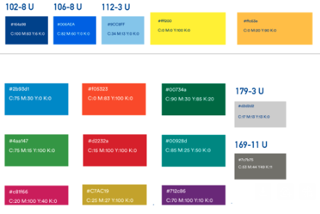

# Minuta de Revisión y Aprobación de Propuesta

Proyecto: Nueva sección de eventos – Plataforma Política Nacional en Discapacidad

Fecha: 02/27/2026

#### Participantes

- M.Sc. Verónica Mora Lezcano (Clienta)
- Nelson Fernández (Desarrollador)

#### Objetivo de la minuta

Validar que la propuesta de implementación de la sección de eventos respete íntegramente el diseño realizado en el año 2020, manteniendo todas las funcionalidades, flujo y estructura original del sistema.

#### Aspectos tratados durante la validacion.

Se acordo que:
- La implementación deberá apegarse estrictamente al diseño original.
- No se eliminarán funcionalidades existentes.
- No se modificarán flujos del sistema.
- Se mantendrán los tres tipos de usuario:
   * Consultante
   * Editor
   * Administrador
- Se conservarán todas las secciones:  
   * Eventos publicados
   * Eventos borrador
   * Eventos eliminados
   * Eventos pasados
   * Lista de difusión
   * Proceso de aprobación de eventos

- Se mantendrá el proceso de revisión y aprobación antes de publicar eventos.
- Se conservarán las notificaciones y mensajes de confirmación del sistema.

#### Materiales presentados para la validacion.

- Se hizo uso de un google form para poder validar con la clienta datos crucuales sobre el desarrollo de la pagina web.

### Acuerdos

-   Se utilizará exclusivamente la nueva paleta de colores proporcionada, adjuntada aqui abajo como referencia:

-	Se podrán combinar colores de la paleta y ajustar niveles de transparencia.
-	Las combinaciones deberán garantizar una correcta legibilidad del contenido.
-	El contraste deberá cumplir con el criterio AA de accesibilidad visual indicado.
-	De la paleta presentada se han escogido la siguiente combinacion de colores:

    * 	#9CC8FF, #006AEA, #162a98, #d2d2d2, #7c7b75

### Compromisos

El desarrollador se compromete a:
- Ajustar la documentación de requerimientos para reflejar fielmente el diseño original.
- No introducir modificaciones no autorizadas.
- Presentar los avances respetando los lineamientos funcionales y visuales establecidos.         

#### Aprobación

Firma cliente: ___________________
Firma desarrollador: ___________________

El cliente dio la aprobacion por medio de correo electronico, sin embargo no se recibio el documento de la minuta firmado de vuelta.